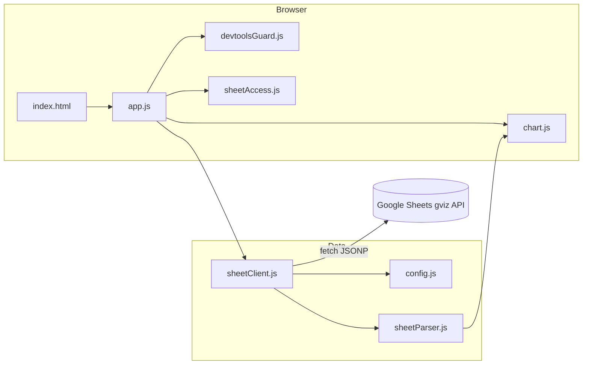

# CNF Live Chart

Dashboard web theo dõi **breadth thị trường CNF** (tỷ lệ cổ phiếu trên MA10/20/50/200) với dữ liệu tự động đồng bộ từ Google Sheets, biểu đồ Plotly realtime và giao diện dark theme.


---

## Mục lục

- [Giới thiệu](#giới-thiệu)
- [Tính năng](#tính-năng)
- [Cài đặt](#cài-đặt)
- [Sử dụng](#sử-dụng)
- [Cấu hình](#cấu-hình)
- [Cấu trúc dự án](#cấu-trúc-dự-án)
- [Kiểm thử](#kiểm-thử)
- [Kiến trúc](#kiến-trúc)
- [Giấy phép](#giấy-phép)
- [Liên hệ](#liên-hệ)

---

## Giới thiệu

**CNF Live Data Chart Engine** là ứng dụng web client-side giúp analyst/trader theo dõi độ rộng thị trường (market breadth) theo thời gian thực. Google Sheet là nguồn dữ liệu duy nhất — chỉnh sửa trên Sheet, dashboard tự cập nhật.

### Công nghệ

| Thành phần | Công nghệ |
|------------|-----------|
| Frontend | HTML5, CSS3, Vanilla JavaScript (ES Modules) |
| Biểu đồ | [Plotly.js 2.35.2](https://plotly.com/javascript/) (CDN) |
| Dữ liệu | Google Sheets Visualization API (gviz) |
| Runtime | Node.js (chỉ dùng cho dev server & test) |
| Test | Node.js built-in test runner |

### Yêu cầu Sheet

Tab **`Market_Regime_Input`** với 14 cột dữ liệu:

| Cột | Biến | Nội dung |
|-----|------|----------|
| A | Date | Ngày giao dịch (hỗ trợ định dạng chuẩn Excel hoặc gviz) |
| B | MA10 VNIndex | Giá trị MA10 của chỉ số VNIndex |
| C | MA20 VNIndex | Giá trị MA20 của chỉ số VNIndex |
| D | MA50 VNIndex | Giá trị MA50 của chỉ số VNIndex |
| E | %CP > MA10 | Tỷ lệ % cổ phiếu trên đường MA10 của chính nó |
| F | %CP > MA20 | Tỷ lệ % cổ phiếu trên đường MA20 của chính nó |
| G | %CP > MA50 | Tỷ lệ % cổ phiếu trên đường MA50 của chính nó |
| H | %CP > MA200 | Tỷ lệ % cổ phiếu trên đường MA200 của chính nó |
| I | S50 | Tỷ lệ % cổ phiếu có MA50 dốc lên (MA50(t) > MA50(t-10)) |
| J | MACD_Pos | Tỷ lệ % cổ phiếu có MACD > 0 |
| K | ShortBreadth_Drawdown10 | Mức co hẹp độ rộng ngắn hạn so với đỉnh 10 phiên |
| L | B50_Drawdown20 | Mức co hẹp của B50 so với đỉnh 20 phiên |
| M | ShortBreadth_Rebound10 | Mức hồi phục độ rộng ngắn hạn so với đáy 10 phiên |
| N | B20_Change5 | Thay đổi tỷ lệ B20 so với 5 phiên giao dịch trước |

Sheet phải **công khai** (Anyone with the link can view).

---

## Tính năng

### Tính năng chính

- **Đồng bộ Google Sheets** — Tự động đồng bộ 14 cột chỉ số và poll mỗi 10 giây (cấu hình được).
- **Đánh giá Market Regime tự động** — Tự động phân loại 5 trạng thái thị trường, 5 chế độ đầu tư và trần rủi ro khuyến nghị theo đúng tiêu chuẩn định lượng của CNF.
- **Biểu đồ line chart** — 4 series MA độ rộng (C>MA10/20/50/200) với zoom, pan, range slider và nút 1M / 3M / 6M / YTD / MAX.
- **Bảng dữ liệu tương tác** — Hiển thị dữ liệu đồng bộ, cho phép click vào bất kỳ hàng nào để xem đánh giá thị trường lịch sử của ngày đó.
- **Data Audit** — Kiểm tra điểm đầu, giữa, cuối chuỗi dữ liệu.
- **Snapshot & Insight CNF** — Số liệu cuối kỳ và nhận định tự động cập nhật động theo ngày được chọn.
- **Làm mới thủ công** — Nút refresh dữ liệu lập tức bất cứ lúc nào.

### Tính năng nâng cao

- **Đổi nguồn Sheet** — Nhập link Google Sheet khác (cần mở khóa PIN).
- **Bảo vệ PIN 4 chữ số** — Link nguồn bị ẩn cho đến khi nhập đúng mã.
- **Logo CNF** — Badge góc phải header + watermark giữa biểu đồ.
- **Chặn DevTools** — Tắt phím tắt DevTools và menu chuột phải (cấu hình được).

---

## Cài đặt

### Yêu cầu

- [Node.js](https://nodejs.org/) >= 18
- npm (đi kèm Node.js)
- Trình duyệt hiện đại (Chrome, Edge, Firefox)

### Các bước

```bash
# 1. Clone repository
git clone https://github.com/ntd237/auto_update_data_excel_05072026.git
cd auto_update_data_excel_05072026

# 2. (Tuỳ chọn) Không cần npm install — dự án không có dependencies runtime
#    Chỉ cần Node.js để chạy dev server và test

# 3. Chạy dev server
npm start
```

Mở trình duyệt tại: **http://localhost:3000**

> **Giải pháp thay thế (Không cần Node.js):** Nếu máy bạn chưa có sẵn Node.js, bạn có thể khởi chạy server tĩnh cục bộ bằng Python:
> ```bash
> python -m http.server 3000
> ```
> Sau đó mở trình duyệt và truy cập `http://localhost:3000`.

> **Quan trọng:** Không mở trực tiếp `index.html` bằng double-click. Trình duyệt chặn ES Modules và fetch Google Sheets từ giao thức `file://`.

### Xác minh cài đặt

```bash
npm test
```

Kết quả mong đợi: tất cả test pass (30 tests).

---

## Sử dụng

### Khởi động nhanh

1. Chạy `npm start`
2. Truy cập `http://localhost:3000`
3. Dashboard tự tải dữ liệu từ Sheet mặc định trong `src/config.js`
4. Biểu đồ, bảng và insight cập nhật tự động mỗi 10 giây

### Đổi nguồn Google Sheet

1. Bấm **Mở khóa nguồn**
2. Nhập mã PIN 4 chữ số (mặc định cấu hình trong `SHEET_ACCESS_PIN`)
3. Dán link Sheet mới → bấm **Áp dụng**
4. Bấm **Khóa lại** để ẩn link sau khi xong

Link hỗ trợ các định dạng:

```
https://docs.google.com/spreadsheets/d/<SHEET_ID>/edit
https://docs.google.com/spreadsheets/d/<SHEET_ID>/edit?usp=sharing
<SHEET_ID>   (chỉ ID)
```

### Thao tác biểu đồ

- **Zoom / Pan** — Kéo trên biểu đồ hoặc dùng range slider phía dưới
- **Chọn khoảng thời gian** — Nút 1M, 3M, 6M, YTD, MAX
- **Hover** — Xem giá trị tất cả series tại một ngày

---

## Cấu hình

Tất cả cấu hình nằm trong `src/config.js`:

| Hằng số | Mặc định | Mô tả |
|---------|----------|-------|
| `SHEET_ID` | *(xem file)* | ID Google Sheet mặc định |
| `SHEET_NAME` | `"Dem MA"` | Tên tab sheet |
| `POLL_MS` | `10000` | Chu kỳ poll (ms) |
| `GVIZ_QUERY` | `"select A,C,M,W,AG"` | Truy vấn cột gviz |
| `SHEET_ACCESS_PIN` | `"2406"` | Mã PIN 4 chữ số mở khóa nguồn Sheet |
| `ALLOW_DEVTOOLS` | `false` | `true` = cho phép DevTools khi dev |

Ví dụ bật DevTools khi phát triển:

```javascript
export const ALLOW_DEVTOOLS = true;
```

> **Lưu ý bảo mật:** PIN và chặn DevTools chỉ là lớp bảo vệ phía client. Không thay thế bảo mật server-side.

---

## Cấu trúc dự án

```
auto_update_data_excel_05072026/
├── assets/
│   └── logo.jpg              # Logo CNF (badge + watermark)
├── src/
│   ├── app.js                # Entry point, UI binding, polling
│   ├── chart.js              # Plotly chart, audit, insight
│   ├── config.js             # Cấu hình tập trung
│   ├── devtoolsGuard.js      # Chặn DevTools shortcuts
│   ├── runtime.js            # Kiểm tra giao thức file://
│   ├── sheetAccess.js        # PIN lock cho nguồn Sheet
│   ├── sheetClient.js        # Fetch dữ liệu từ Google Sheets
│   └── sheetParser.js        # Parse JSONP gviz response
├── styles/
│   └── main.css              # Dark theme UI
├── tests/
│   ├── config.test.js
│   ├── devtoolsGuard.test.js
│   ├── runtime.test.js
│   ├── sheetAccess.test.js
│   └── sheetParser.test.js
├── index.html                # Trang chính
├── package.json
├── logo.jpg                  # Logo gốc
└── README.md
```

---

## Kiểm thử

```bash
# Chạy toàn bộ test
npm test

# Chạy một file test cụ thể
node --test tests/sheetParser.test.js
```

Phạm vi test hiện tại:

- Parse URL Google Sheet
- Parse response gviz (ngày VN, phần trăm)
- Xác thực PIN nguồn Sheet
- Phát hiện giao thức `file://`
- Logic chặn phím tắt DevTools

---

## Kiến trúc



Luồng dữ liệu:

1. `app.js` poll theo `POLL_MS`
2. `sheetClient.js` gọi gviz URL từ `config.js`
3. `sheetParser.js` chuyển JSONP → mảng object `{ dateText, ma10, ma20, ma50, ma200 }`
4. `chart.js` render Plotly + cập nhật audit/insight
5. Chỉ re-render khi hash dữ liệu thay đổi

---

## Giấy phép

Dự án **Private** — không cấp phép sử dụng công khai. Mọi quyền được bảo lưu.

---

## Liên hệ

**namth246**

- Email: [tranhoainam240604@gmail.com](mailto:tranhoainam240604@gmail.com)
- GitHub: [https://github.com/namth246](https://github.com/namth246)
# danh_gia_thi_truong

# danh_gia_thi_truong

